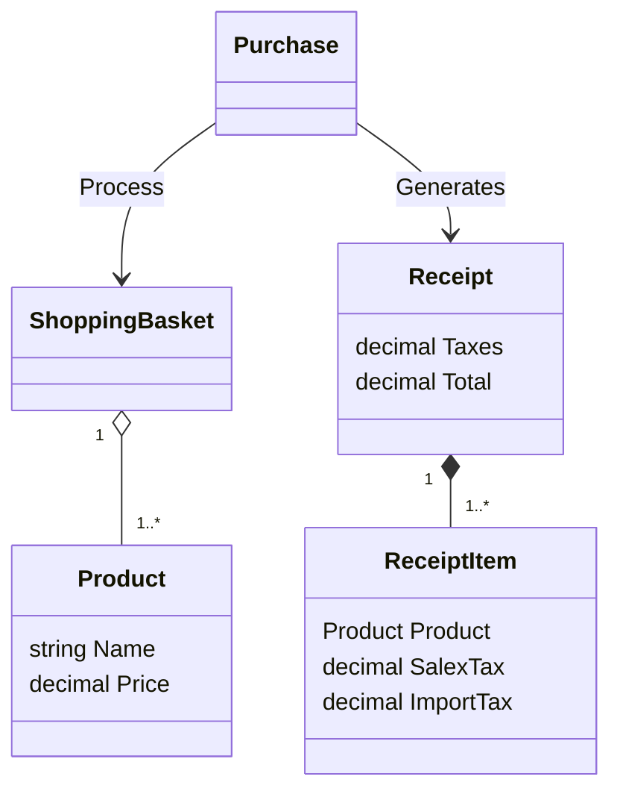
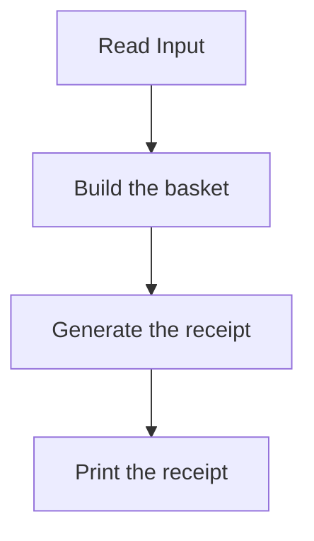
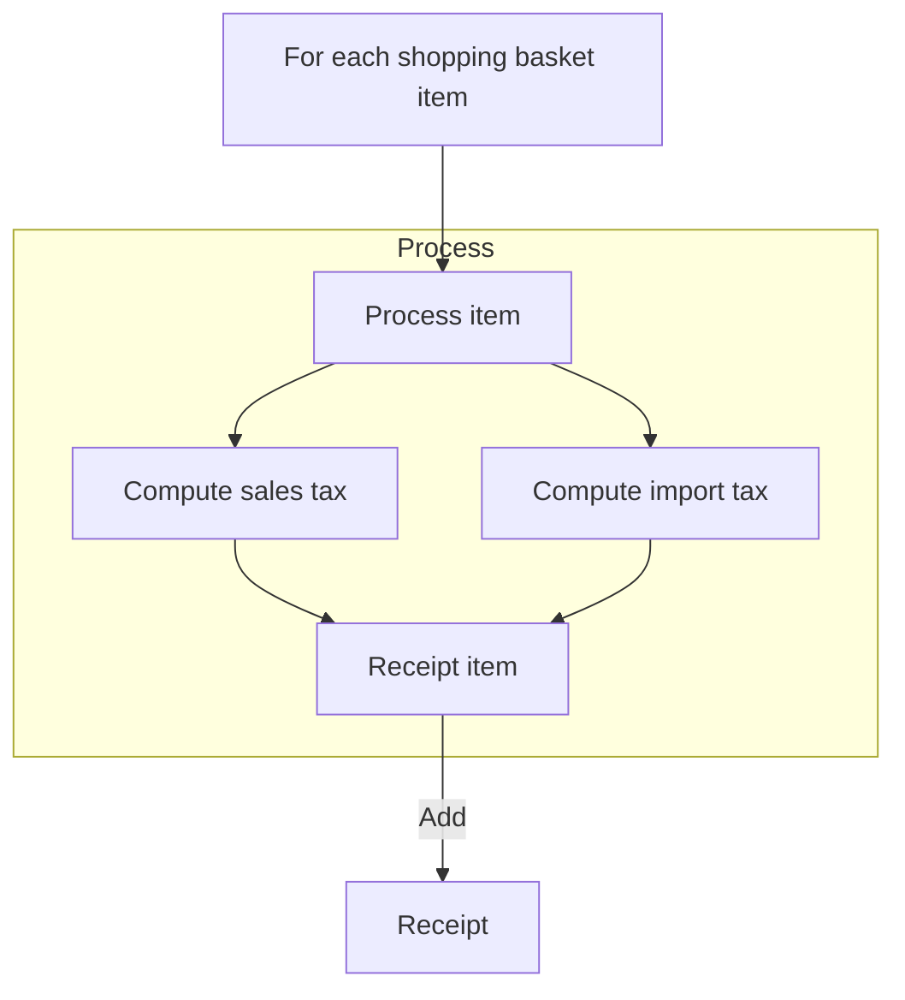

# Sales Taxes - PROBLEM TWO
> Problem summarization: process the shopping basket and generates a receipt.

## Running

### Running on Visual Studio

All samples are located in the `App/Resources/` folder:
1. `input-1.txt`
1. `input-2.txt`
1. `input-3.txt`

You can select the desired input file in  `App/Properties/launchSettings.json` file, setting the `commandLineArgs` property. A default input is already provided, so there is no need to configure it for the first run.

### Running on the command line

You can also use the command line as follow:

```
dotnet restore
dotnet build
dotnet test
```

And run each sample as follow (Powershell):

```powershell
cat .\App\Resources\input-1.txt | dotnet run --project App
cat .\App\Resources\input-2.txt | dotnet run --project App
cat .\App\Resources\input-3.txt | dotnet run --project App
```

## Modeling

The problem was modeled using Domain Driven Design (DDD) approach.
The domain is as follow:



## Solution Layers

### App

This is the entry point. This project contains a console application which is responsible for getting the input from the console, requesting the processing of the shopping basket and then printing back the receipt to the console.



The `PurchaseService` is a service designed to orchestrate the domain objects, receiving a shopping basket and returning a receipt.
The `PrintReceiptService` is the service responsible to print the receipt in the specified format.

### Domain

On the domain layer, a `Purchase` object is responsible for processing the `ShoppingBasket`.
The `Purchase` process is as follow:



A `Receipt` object is responsible for computing the `total` and `sales tax`, which is a simple sum of all `ReceiptItems` objects.

### Test

The solution includes unit tests, and all sample inputs can be verified on the `Receipt_Tests` test set.
